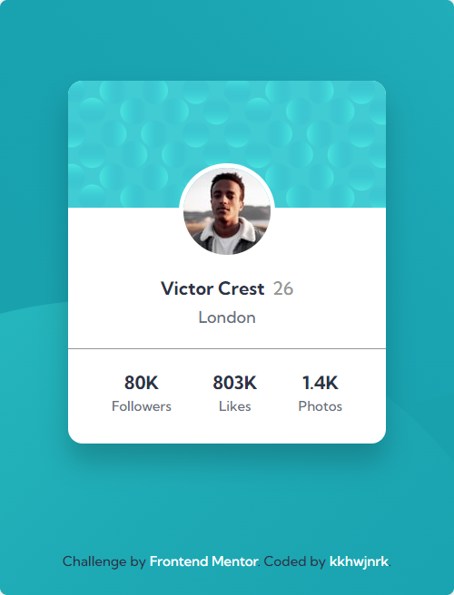
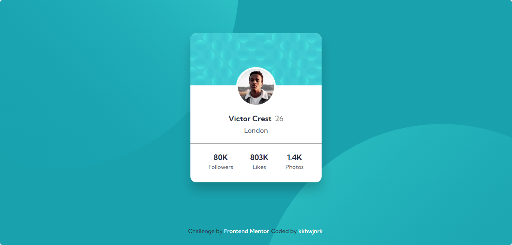

# Profile Card Component 📄💻

This project is my submission for the Frontend Mentor Profile Card Components challenge, in which I was assigned to create a profile card. I made it responsive using HTML and Sass. I'm taking a mobile-first approach to ensure a responsive design across multiple screen sizes.

### Design 🎨

The profile card component showcases a background image and a content section that displays the user's profile image, name, age, and location. The component also includes a social statistics section showcasing the user's follower count, number of likes, and photos. For an example, please visit the [Mobile](./design/mobile-design.jpg) and [Desktop design](./design/desktop-design.jpg).

### Technologies Used 💻

- HTML
- Sass
- CSS Grid
- Mobile-first design

### Live Demo 🔴

You can view the live demo of the project [here](https://profile-card.kkhwjnrk.vercel.app/).

### Preview 👀

  

### Credits 💡

This project was completed as part of the [Frontend Mentor](https://www.frontendmentor.io) challenge. Check out their website for more projects to help improve your frontend development skills.

### About Me 🙋‍♀️

You can view my profile [here](https://www.frontendmentor.io/profile/kkhwjnrk).
